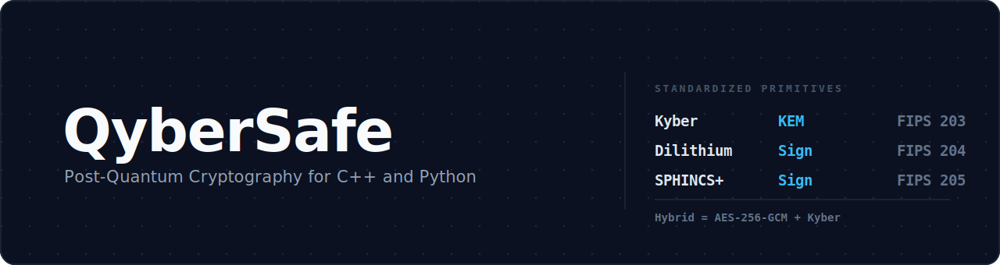

<p align="center">
  
</p>

<p align="center">
  <a href="https://github.com/Nathandona/QyberSafe/actions/workflows/ci.yml"></a>
  
  
  
  
  
  
  
</p>

# QyberSafe

QyberSafe is a modern C++ and Python library for integrating post-quantum cryptography into real applications. It provides modular, crypto-agile primitives for quantum-resistant key exchange, digital signatures, and hybrid encryption, built for fintech, cloud, and enterprise systems that need to stay secure against future quantum attacks.

Classical algorithms such as RSA and ECC are vulnerable to large-scale quantum computers. QyberSafe implements the NIST-standardized lattice and hash based schemes so you can defend against "harvest now, decrypt later" attacks today, with an API designed to swap algorithms as standards evolve.

> Status: 0.1.0 alpha. The API is stabilizing and not yet recommended for production deployments.

## Features

- Simple, modern API for C++17 with first-class Python bindings
- NIST-standardized algorithms: Kyber (ML-KEM), Dilithium (ML-DSA), SPHINCS+ (SLH-DSA)
- Drop-in hybrid encryption combining classical (AES-256-GCM) and post-quantum key exchange
- Crypto agility: change algorithms or security levels with minimal code changes
- Security-focused design: secure memory zeroing, constant-time operations, side-channel mitigations
- Cross-platform builds on Linux, macOS, and Windows
- Continuous integration with sanitizers, Valgrind, and static analysis

## Algorithms

| Algorithm  | Type                  | NIST standard | Security levels                  |
|------------|-----------------------|---------------|----------------------------------|
| Kyber      | Key encapsulation     | FIPS 203      | Kyber512, Kyber768, Kyber1024    |
| Dilithium  | Digital signature     | FIPS 204      | Dilithium2, Dilithium3, Dilithium5 |
| SPHINCS+   | Hash-based signature  | FIPS 205      | SPHINCS128, SPHINCS192, SPHINCS256 |
| Hybrid     | Classical plus PQC     | -             | AES-256-GCM with Kyber           |

Each security level maps to roughly 128, 192, and 256 bit quantum resistance. The middle level is the recommended default for most workloads.

## Installation

### Requirements

- C++17 compiler (GCC 11+, Clang, or MSVC)
- CMake 3.16 or newer
- OpenSSL
- Python 3.8 or newer (for Python bindings)

### Build the C++ library

```bash
git clone https://github.com/Nathandona/QyberSafe.git
cd QyberSafe
cmake -B build -DCMAKE_BUILD_TYPE=Release
cmake --build build --parallel
ctest --test-dir build --output-on-failure
sudo cmake --install build
```

### Install the Python bindings

```bash
cd python
pip install .
```

## Quick start

### C++

```cpp
#include <qybersafe/qybersafe.h>

using namespace qybersafe;

int main() {
    // Key encapsulation with Kyber
    auto keypair = kyber::generate_keypair(kyber::SecurityLevel::Kyber768);

    bytes message = {'h', 'e', 'l', 'l', 'o'};
    bytes ciphertext = kyber::encrypt(keypair.public_key(), message);
    bytes plaintext  = kyber::decrypt(keypair.private_key(), ciphertext);

    // Digital signatures with Dilithium
    auto signer = dilithium::generate_keypair();
    bytes signature = dilithium::sign(signer.private_key(), message);
    bool valid = dilithium::verify(signer.public_key(), message, signature);

    return valid ? 0 : 1;
}
```

### Python

```python
import qybersafe

# Generate a Kyber key pair (Kyber768 by default)
keypair = qybersafe.generate_keypair()

plaintext = b"Hello, post-quantum world!"
ciphertext = qybersafe.encrypt(keypair.public_key, plaintext)
decrypted = qybersafe.decrypt(keypair.private_key, ciphertext)

assert decrypted == plaintext
```

## Why post-quantum

A sufficiently powerful quantum computer running Shor's algorithm would break the public-key cryptography that secures most of the internet today. Attackers can already record encrypted traffic now and decrypt it later once such hardware exists, which is why long-lived secrets need quantum-resistant protection immediately. QyberSafe lets you adopt NIST PQC standards incrementally through hybrid modes, keeping classical guarantees while adding a post-quantum layer.

## Roadmap

- Additional language bindings (Go, Rust, JavaScript and WebAssembly)
- TLS and SSH hybrid protocol modules
- Hardware security module (HSM) integration
- Hardware acceleration and SIMD optimizations
- Benchmark suite and formal verification of critical components

See [CHANGELOG.md](CHANGELOG.md) for release history.

## Documentation

API reference is generated with Doxygen. Build it locally with:

```bash
cmake --build build --target docs
```

Runnable examples for each algorithm live in [src/examples](src/examples).

## Contributing

Contributions are welcome. Please read [CONTRIBUTING.md](CONTRIBUTING.md) before opening a pull request, and file an issue for bugs, integration questions, or feature requests.

## Security

QyberSafe is alpha software and has not undergone an independent security audit. Do not rely on it to protect production secrets yet. Report vulnerabilities privately through [GitHub Security Advisories](https://github.com/Nathandona/QyberSafe/security/advisories/new) rather than through public issues.

## License

Released under the MIT License.
